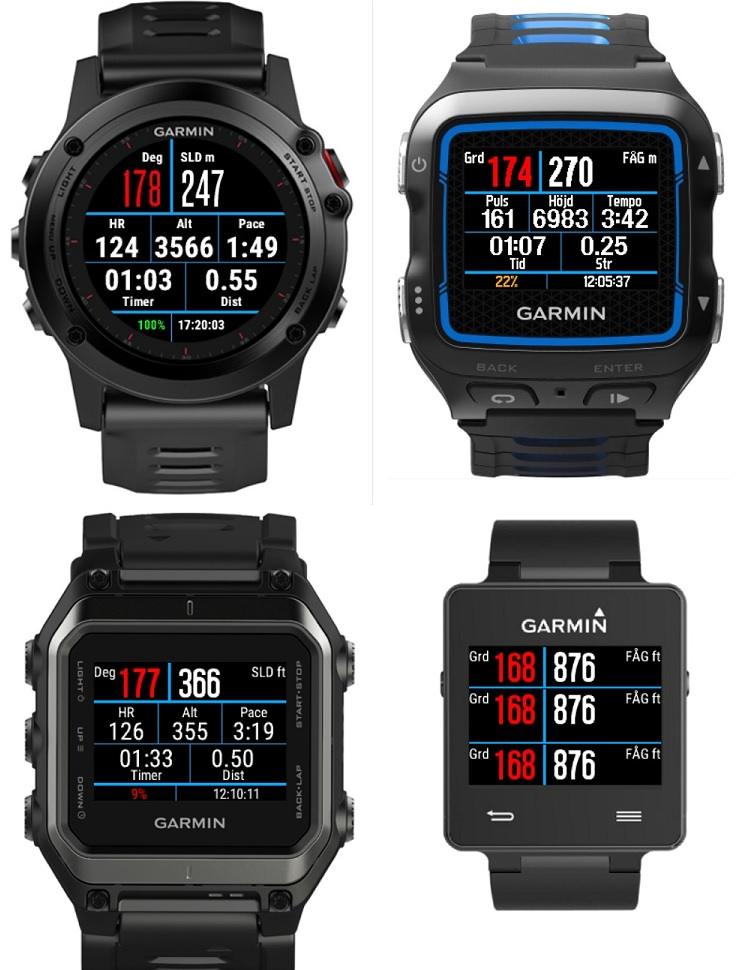

# ORun - Data field for Garmin Connect IQ

A custom orienteering data-field for Garmin Connect IQ devices.

Supported devices; Fenix3, Epix, Fr920xt, Fr735xt, Fr630, Fr235, Fr230 and Vivoactive.
Requires Connect IQ v1.3.0, currently available as a beta in Garmin's "Biker Monkey" SDK offering.

Pressing 'start' or 'lap' sets the current reference waypoint.
From left to right, top to bottom these are the displayed fields:

1. Bearing from the last waypoint in degrees
2. Straight line distance from last waypoint
3. Heart-rate
4. Altitude delta from last waypoint
5. Current pace
6. Elapsed time
7. Total actual distance 
8. Battery power
9. Time of day

